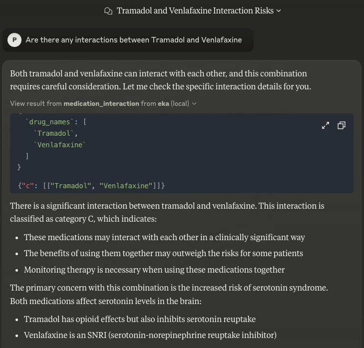

# Eka MCP Server

## Overview

Healthcare professionals frequently need to switch context to access additional information while treating patients. While AI can serve as a bridge to provide this information, there is an inherent risk of hallucination. 
The Eka MCP server addresses this challenge by grounding Large Language Model (LLM) responses in curated medical information from eka.care.

The Model Context Protocol (MCP) functions as a universal interface for AI applications, enabling LLMs to access and utilize relevant information effectively. 
The open-source ecosystem for MCP is growing strongly, the Eka MCP server specifically targets healthcare use cases with curated medical tools.

# Tools
> EKA MCP server tools are curated by the in-house doctors at eka.care and have been validated on an internal set of questionnaire 

## Medications tool suite
### Medication Understanding tool 
<details>
<summary>Tool definition here</summary>
https://github.com/eka-care/eka_mcp_server/blob/14ea2d17ac4d93e619583a4b719a925180d8ff7d/src/eka_assist/mcp_server.py#L113-L120
</details>


Access to a comprehensive corpus of drugs based on the drug name or generic composition and filtered further through the drug form and volume

APIs required for this tool
   - https://developer.eka.care/api-reference/eka_mcp/medications/search 

### Medication Interaction
<details>
<summary>Tool definition here</summary>
https://github.com/eka-care/eka_mcp_server/blob/14ea2d17ac4d93e619583a4b719a925180d8ff7d/src/eka_assist/mcp_server.py#L122-L126
</details>

Check for potential interactions between drugs based on the X,A,B,C,D severity levels 
   - 
APIs required for this tool
   - https://developer.eka.care/api-reference/eka_mcp/medications/search - to get the generic composition of the drug name to check for interactions
   - https://developer.eka.care/api-reference/eka_mcp/medications/interactions

## Treatment Protocols
<details>
<summary>Tool definition here</summary>
https://github.com/eka-care/eka_mcp_server/blob/14ea2d17ac4d93e619583a4b719a925180d8ff7d/src/eka_assist/mcp_server.py#L128-L174
</details>

Standardized guidelines, procedures, and decision pathways for healthcare professionals are published by medical bodies.
They serve as comprehensive roadmaps for clinical care, ensuring consistent and evidence-based treatment approaches.
**Currently, we support 175 tags and 180 protocols**
   - **Publishers**: Organizations responsible for developing, validating, distributing, and maintaining medical protocols.
   - **Tags**: Metadata related to conditions, clinical situations or workflows that protocols address.

### Workflow
1. For any given query, the LLM has to decide if the tag is supported or not through [this API](http://developer.eka.care/api-reference/eka_mcp/protocols/tags). During the init of the tool, we fetch the supported conditions.
2. Then, for the given tag, the LLM has to get the publishers that address that tag through [this API](http://developer.eka.care/api-reference/eka_mcp/protocols/publishers_by_tag).
3. Finally, with the tag, publisher and query, we fetch the relevant information from the repository of publishers through [this API](http://developer.eka.care/api-reference/eka_mcp/protocols/search).

APIs required for this tool
1. http://developer.eka.care/api-reference/eka_mcp/protocols/tags
2. http://developer.eka.care/api-reference/eka_mcp/protocols/publishers_by_tag
3. http://developer.eka.care/api-reference/eka_mcp/protocols/search


# Get Started
## Get your developer key from eka.care
> You can obtain the `eka-api-host`, `client-id`, and `client-token` from developer tools or by contacting the Eka support team.

## Installation and Setup for Claude
1. Clone this repository
2. Download and install Claude desktop application.
3. Locate the configuration file:
   - **macOS**: `/Library/Application\ Support/Claude/claude_desktop_config.json`
   - **Windows**: `%APPDATA%/Claude/claude_desktop_config.json`

4. Modify the configuration file with the following settings:

```json
{
  "mcpServers": {
     ...
    "eka-mcp-server": {
      "command": "uv",
      "args": [
        "--directory",
        "<eka_mcp_server_folder_path>",
        "run",
        "eka_assist",
        "--eka-api-host",
        "<eka_api_host>",
        "--client-id",
        "<client_id>",
        "--client-token",
        "<client_token>"
      ]
    }, 
     ...
  }
}
```
4. Replace the placeholder values:
   - `<eka_mcp_server_folder_path>`: Path to the folder containing the Eka MCP server
   - `<eka_api_host>`: Eka API host URL
   - `<client_id>`: Your client ID
   - `<client_token>`: Your client token

## Debugging

Since MCP servers run over stdio, debugging can be challenging. For the best debugging experience, we recommend using the [MCP Inspector](https://github.com/modelcontextprotocol/inspector).

You can launch the MCP Inspector via [`npm`](https://docs.npmjs.com/downloading-and-installing-node-js-and-npm) with this command:

```bash
npx @modelcontextprotocol/inspector uv --directory <eka_mcp_server_folder_path> run eka_assist
```
Upon launching, the Inspector will display a URL that you can access in your browser to begin debugging.

## Usage

Once installed and configured correctly, the Eka MCP server will be available to your Claude client. You can interact with the available tools through the Claude interface to:

- Look up medications and their compositions
- Check for drug interactions
- Access treatment protocols for specific conditions
- Verify treatment guidelines from trusted medical publications

## Support

For additional support, please refer to the complete documentation or contact the Eka support team at support@eka.care.