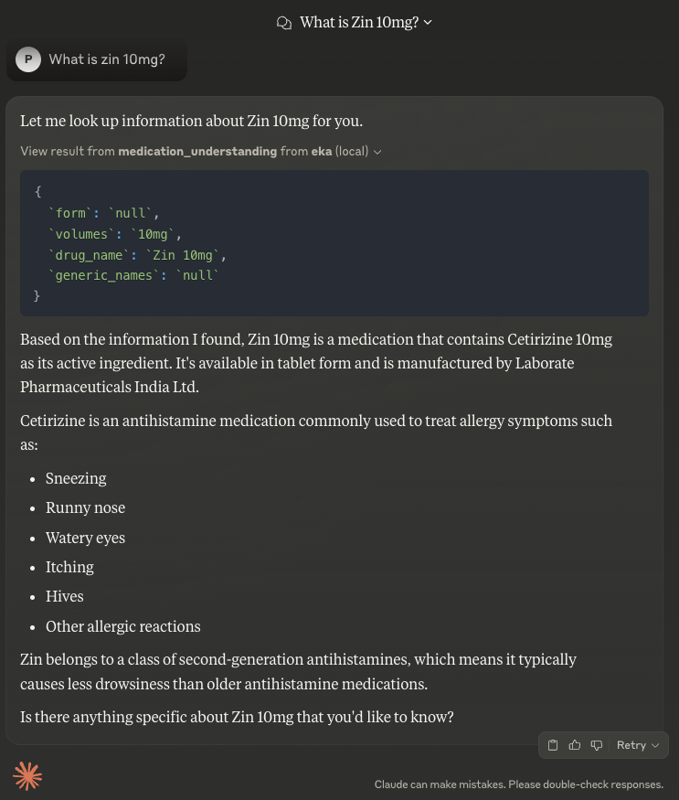
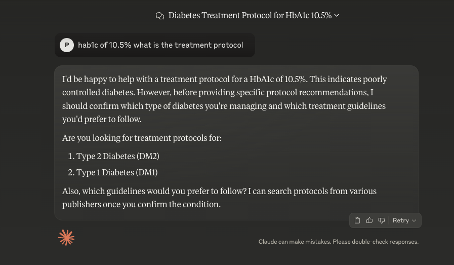
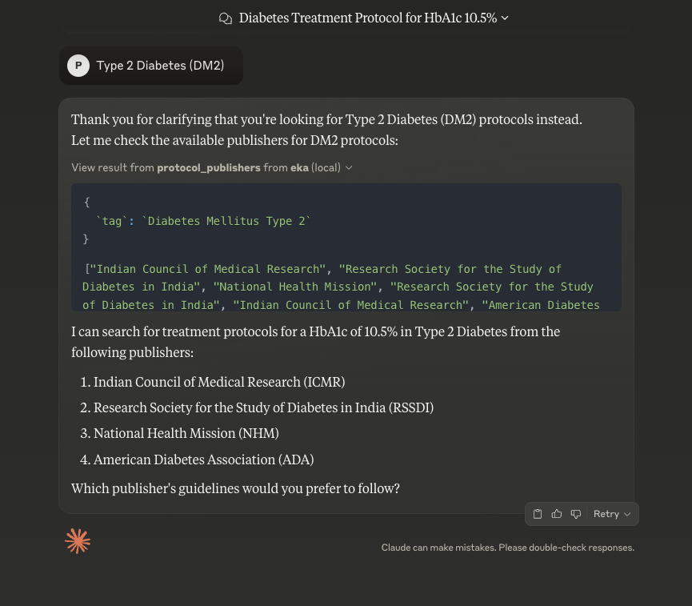
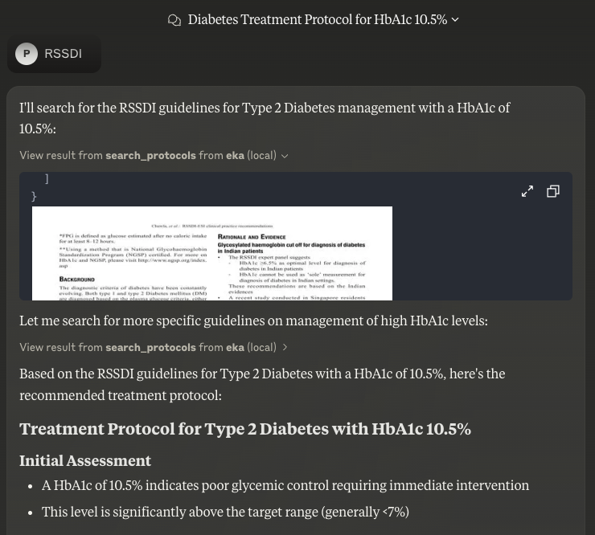

# Eka MCP Server
[](https://github.com/eka-care/eka_mcp_server/blob/main/LICENSE)
[](https://pypi.org/project/eka_mcp_server)
[](https://pepy.tech/project/eka_mcp_server)

## Overview

Eka Care's Model Context Protocol (MCP) server facilitates interaction with medical knowledge-bases specifically curated for the Indian healthcare context. While advanced models from Claude, OpenAI, and others can perform adequately in medical contexts, their responses often lack grounding in factual information and published references. Additionally, India faces a significant challenge with the absence of centralized repositories for branded medications in the public domain.

The Eka MCP Server addresses these challenges by providing structured access to curated knowledge-bases through specialized tools:

* **Medication Understanding**: Enables lookup across 500,000+ branded drugs available in India, returning comprehensive metadata including generic composition and manufacturer information to enhance LLM responses.
* **Treatment Protocols**: Provides contextual access to over 180 treatment protocol documents published by authoritative Indian healthcare institutions such as ICMR and RSSDI.


Key Benefits:
* 🩺 Medical Accuracy: Grounds AI responses in verified healthcare information
* 🔄 Seamless Workflow: Provides critical information without requiring context switching
* 🛡️ Reduced Hallucinations: Relies on curated medical data rather than AI's implicit general knowledge
* 🌐 Open Ecosystem: Integrates with the growing MCP open standard

# Get Started
## Get your developer key from eka.care
> You can obtain the `eka-api-host`, `client-id`, and `client-token` from developer.eka.care or reach out to us on support@eka.care

## Installation and Setup for Claude Desktop
1. Install UV - https://docs.astral.sh/uv/getting-started/installation/#installation-methods
2. Install Claude desktop application - https://claude.ai/download
3. Locate the configuration file:
   - **macOS**: `/Library/Application\ Support/Claude/claude_desktop_config.json`
   - **Windows**: `%APPDATA%/Claude/claude_desktop_config.json`

4. Modify the configuration file with the following settings:

```json
{
  "mcpServers": {
    "eka-mcp-server": {
      "command": "uvx",
      "args": [
        "eka_mcp_server",
        "--eka-api-host",
        "<eka_api_host>",
        "--client-id",
        "<client_id>",
        "--client-secret",
        "<client_secret>"
      ]
    }, 
  }
}
```
5. Replace the placeholder values:
   - `<eka_api_host>`: Eka API host URL
   - `<client_id>`: Your client ID
   - `<client_secret>`: Your client secret

## Debugging

Since MCP servers run over stdio, debugging can be challenging. For the best debugging experience, we recommend using the [MCP Inspector](https://github.com/modelcontextprotocol/inspector).

You can launch the MCP Inspector via [`npm`](https://docs.npmjs.com/downloading-and-installing-node-js-and-npm) with this command:

```bash
npx @modelcontextprotocol/inspector uv --directory <eka_mcp_server_folder_path> run eka_assist
```
Upon launching, the Inspector will display a URL that you can access in your browser to begin debugging.

# Tools
> EKA MCP server tools are curated by the in-house doctors at eka.care and have been validated on an internal set of questionnaire 

## Medications tool suite
### Medication Understanding tool 
<details>
<summary>Tool definition here</summary>
https://github.com/eka-care/eka_mcp_server/blob/14ea2d17ac4d93e619583a4b719a925180d8ff7d/src/eka_assist/mcp_server.py#L113-L120
</details>

Access comprehensive information about drugs from a corpus of drugs based on the drug name or generic composition and filtered further through the drug form and volume.



APIs required for this tool
   - https://developer.eka.care/api-reference/eka_mcp/medications/search 

## Treatment Protocols
<details>
<summary>Tool definition here</summary>
https://github.com/eka-care/eka_mcp_server/blob/14ea2d17ac4d93e619583a4b719a925180d8ff7d/src/eka_assist/mcp_server.py#L128-L174
</details>

Standardized guidelines, procedures, and decision pathways for healthcare professionals are published by medical bodies.
They serve as comprehensive roadmaps for clinical care, ensuring consistent and evidence-based treatment approaches.

Current Coverage:
* 175 medical conditions/tags
* 180 treatment protocols
* Multiple authoritative publishers

### Treatment Protocols Workflow
1. For any given query, the LLM has to decide if the tag is supported or not through [this API](http://developer.eka.care/api-reference/eka_mcp/protocols/tags). During the init of the tool, we fetch the supported conditions.
2. Then, for the given tag, the LLM has to get the publishers that address that tag through [this API](http://developer.eka.care/api-reference/eka_mcp/protocols/publishers_by_tag).
3. Finally, with the tag, publisher and query, we fetch the relevant information from the repository of publishers through [this API](http://developer.eka.care/api-reference/eka_mcp/protocols/search).

APIs required for this tool
1. http://developer.eka.care/api-reference/eka_mcp/protocols/tags
2. http://developer.eka.care/api-reference/eka_mcp/protocols/publishers_by_tag
3. http://developer.eka.care/api-reference/eka_mcp/protocols/search






### Bugs and Issue Reporting
Please report any issues or bugs on the GitHub issue tracker.

## FAQ
**Q: Can I use this without an eka.care account?**

A: No, you need valid API credentials from eka.care to access the medical information.

**Q: Is this service free?**

A: While the MCP server code is open-source, access to eka.care's APIs required valid credentials.

**Q: Which LLMs support MCP natively?**

A: Currently, Anthropic's Claude models have native MCP support and also Cursor and Windsurf applications.
